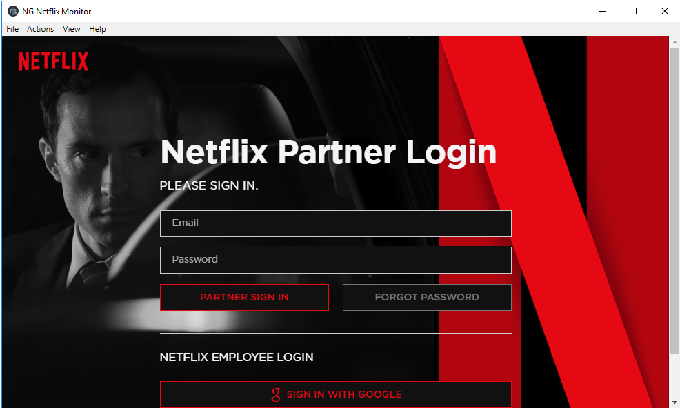
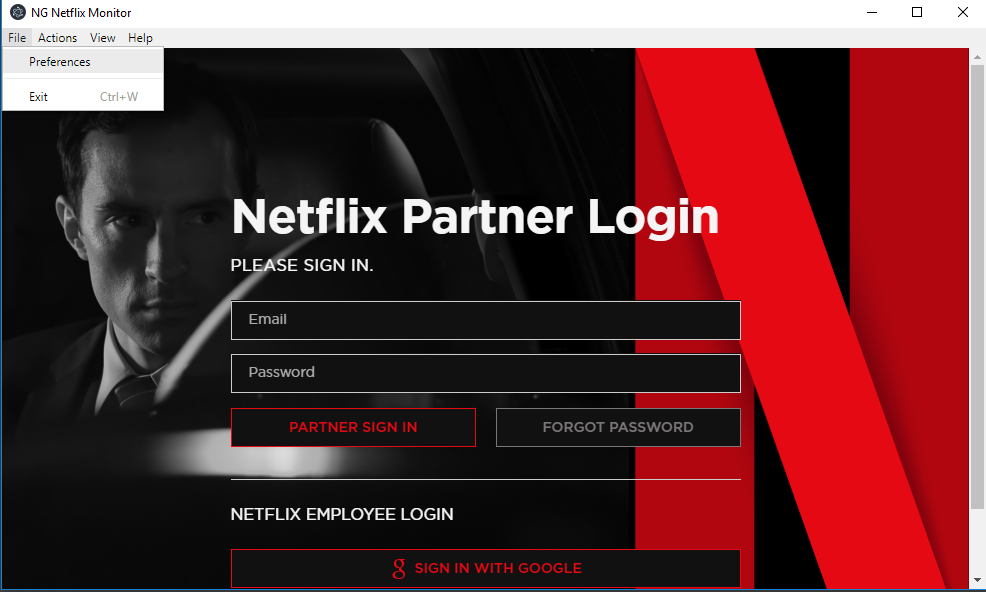
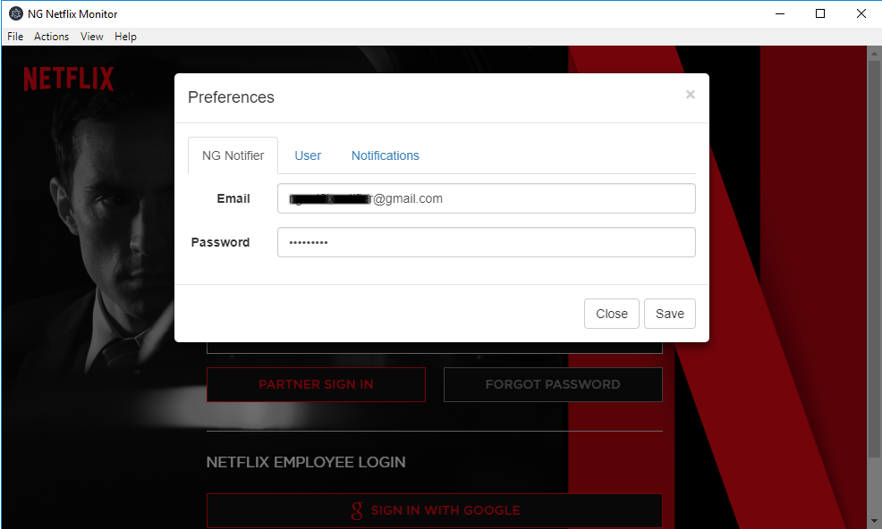
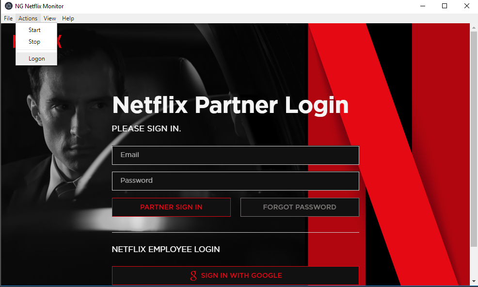
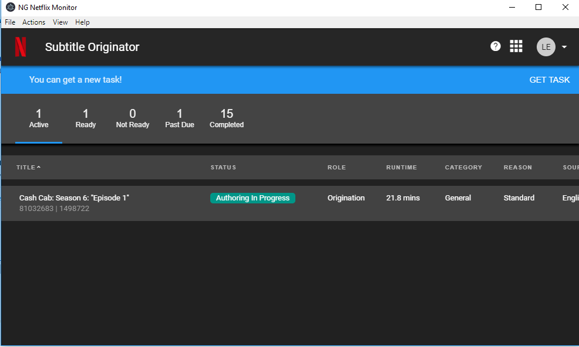
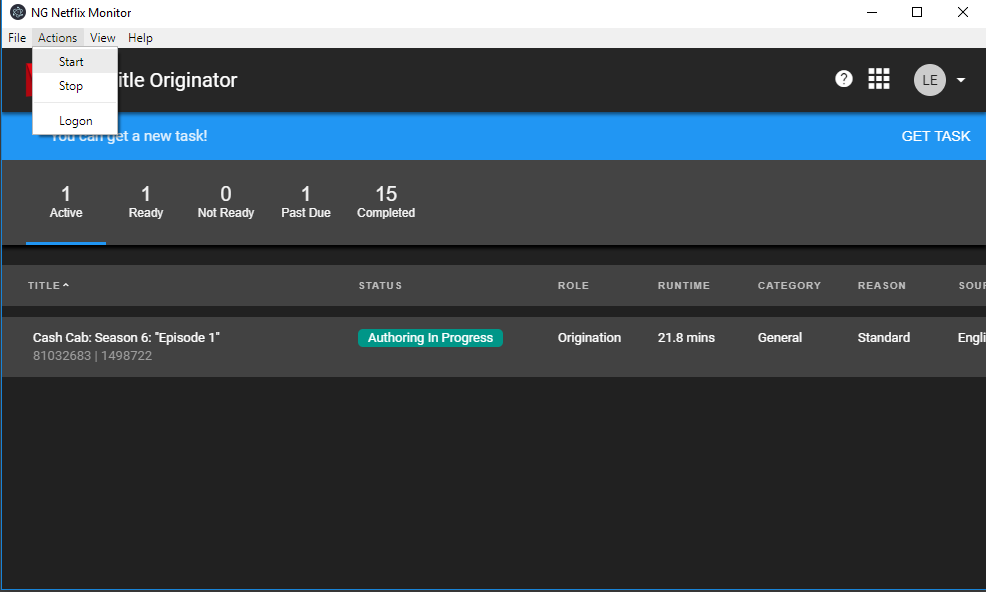
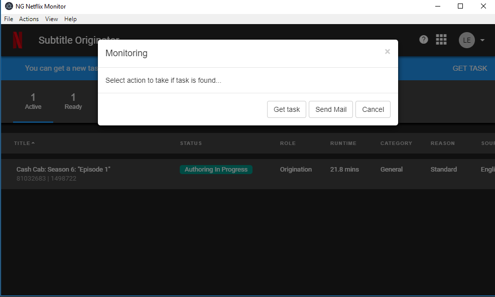
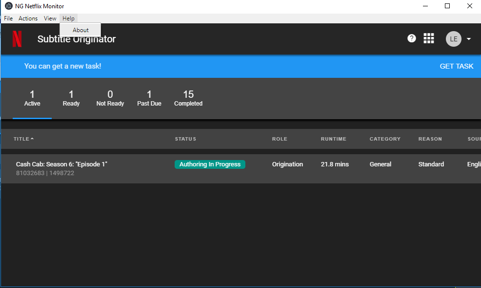

# NGFlix

After installing NGFlix and running the application you will get following window. This is the NG Netflix monitor. It is an application built around the netflix partner site to monitor it and notify when tasks are available. When you run the application the application will check for updates and automatically install them if they are available. 

The application requires some setting up before you can start using it. Clicking on the preferences menu will allow you to provide the application with the information it needs to run.

The NG Notifier is the gmail account used to send emails when tasks are available. The account needs to support plain login.

The user is the username/password setting used to logon to the netflix site. It is used when clicking the Logon menu to logon to the site.

The Notification settings is the email that is going to be notified when new tasks are available.

Clicking Logon will use the configured user to fill in the login fields and submit them to allow fast logon to the site.

After logging on you will get to the tasks page. If you see a task then there is no need to run the monitor. Simply use the site to get the task. If there is no task available then you can activate the monitor to watch for changes.

The start menu will allow you to start monitoring the application.

When you start the monitor you get an option to choose action when task is available. If you choose sending emails than you will get an email when task is available. Choosing 'Get Task' option will automatically click the get task button when it will be available. 

Last but not least the Help menu will provide you with information about the version of the app.

